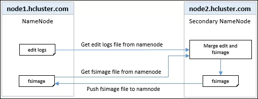
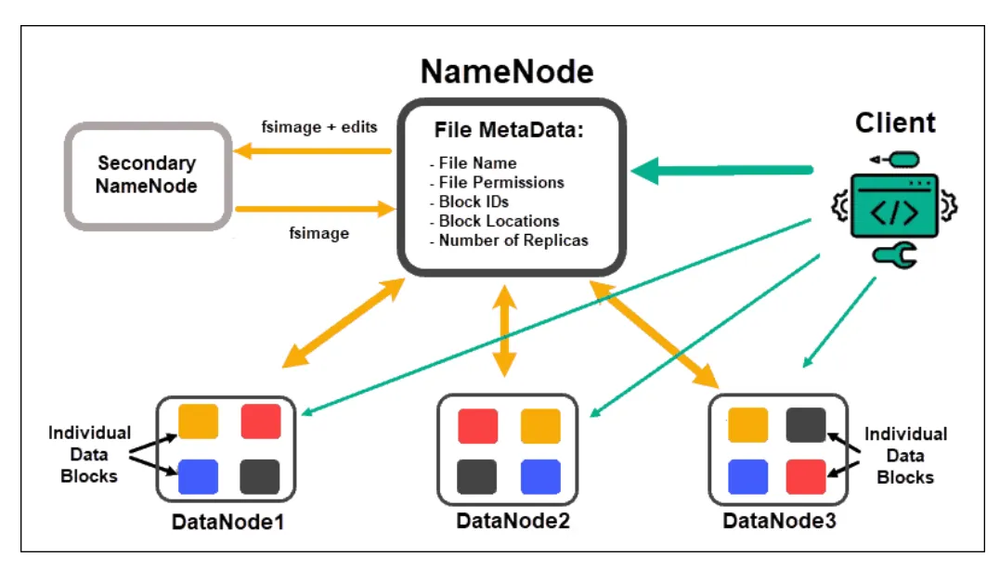
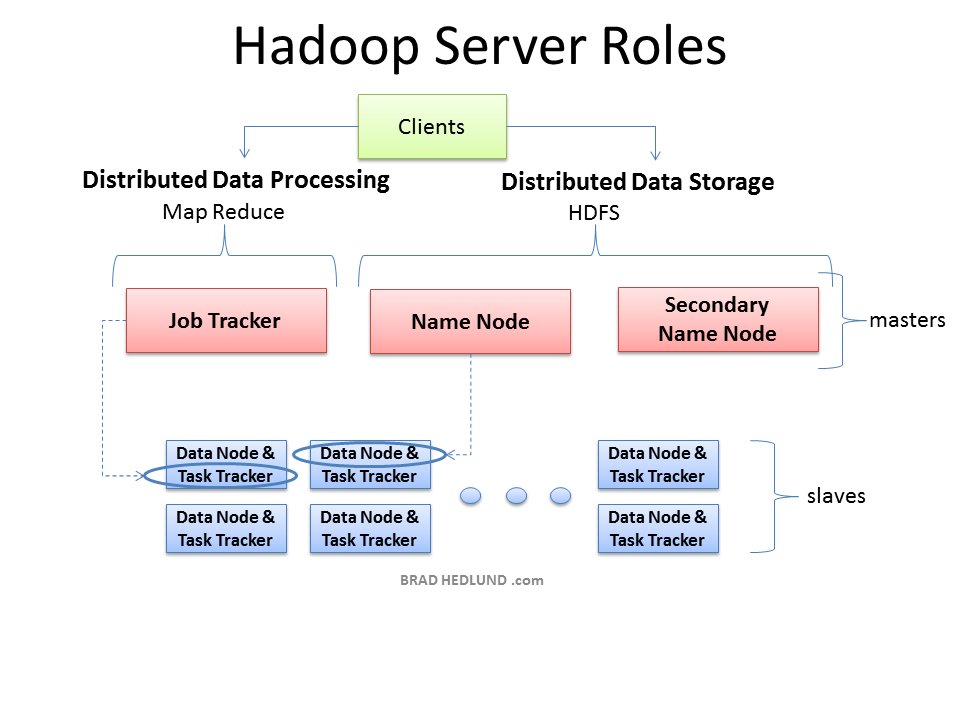

# Hadoop Framework
* Hadoop is a framework (open source) for writing, running, storing, and processing large datasets in a parallel and distributed manner. It is a solution that is used to overcome the challenges faced by big data.

# Hadoop Components
* Common: contains all Java libraries on which all hadoop modules depend
* Hadoop Distributed File System (HDFS): a distributed file system that offers high data access speed and store large amount of data a cross multiple nodes.
* YARN (Yet Another Resource Negotiator): yarn is the clusters manger in hadoop it acts as job scheduler
* MapReduce: it’s a parallel data processing tool that used to process data parallelly across multiple clusters

# Building Blocks of Hadoop:
* Name Node
* Secondary Name Node (SNN)

* Checkpoint Node: The Checkpoint node is a node that periodically creates checkpoints of the namespace. 
Checkpoint Node first downloads Fsimage and edits Namenode. 
Then it merges them (Fsimage and edits) locally, and at last, it uploads the new image back to the NameNode.
It stores the latest checkpoint in a directory that has the same structure as the Namenode’s directory. 
This permits the checkpointed image to be always available for reading by the NameNode if necessary.

* Backup Node: Backup node keeps an in-memory, up-to-date copy of the  file system namespace. It is always synchronized with the NameNode state. The Backup node checkpoint process is more efficient as it only needs to save the namespace into the local Fsimage file and reset edits. NameNode supports one Backup node at a time.

* Data Node

* Job Tracker

* Task Tracker

# Basic operations of Namenode:
* Namenode maintains and manages the Data Nodes and assigns the task to them.
* Namenode does not contain actual data of files.
* Namenode stores metadata of actual data like Filename, path, number of data blocks, block IDs, block location, number of replicas and other slave related informations on the local disk in the form of two files:
  
  Fsimage: Fsimage stands for  File System image. It contains the complete namespace of the Hadoop file system since the NameNode creation.
  
  Edit log: It contains all the recent changes performed to the file system namespace to the most recent Fsimage.

* Namenode manages all the request(read, write) of client for actual data file.
* Namenode executes file system name space operations like opening/closing files, renaming files and directories.

# Basic Operations of Datanode:
* Datanodes is responsible of storing actual data.
* Upon instruction from Namenode, it performs operations like creation/replication/deletion of data blocks.
* When one of Datanode gets down then it will not make any effect on Hadoop cluster due to replication.
* All Datanodes are synchronized in the Hadoop cluster in a way that they can communicate with each other for various operations.