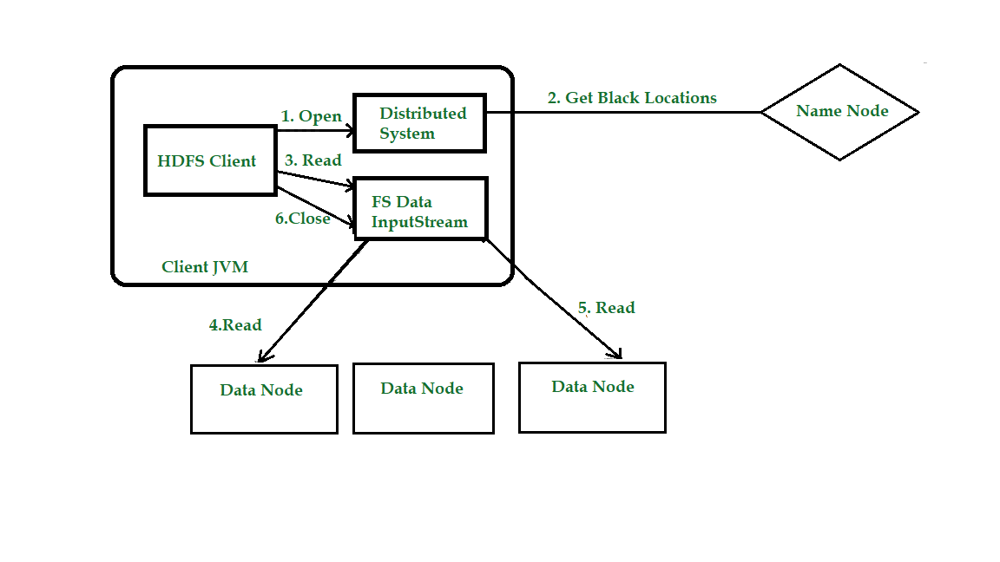
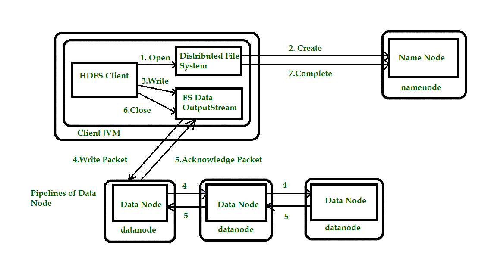

# Anatomy of File Read and Write in HDFS
Let’s get an idea of how data flows between the client interacting with HDFS, the name node, and the data nodes with the help of a diagram. Consider the figure:

# HDFS Read

* Step 1: The client opens the file it wishes to read by calling open() on the File System Object(which for HDFS is an instance of Distributed File System).
* Step 2: Distributed File System( DFS) calls the name node, using remote procedure calls (RPCs), to determine the locations of the first few blocks in the file. For each block, the name node returns the addresses of the data nodes that have a copy of that block. The DFS returns an FSDataInputStream to the client for it to read data from. FSDataInputStream in turn wraps a DFSInputStream, which manages the data node and name node I/O.
* Step 3: The client then calls read() on the stream. DFSInputStream, which has stored the info node addresses for the primary few blocks within the file, then connects to the primary (closest) data node for the primary block in the file.
* Step 4: Data is streamed from the data node back to the client, which calls read() repeatedly on the stream.
* Step 5: When the end of the block is reached, DFSInputStream will close the connection to the data node, then finds the best data node for the next block. This happens transparently to the client, which from its point of view is simply reading an endless stream. Blocks are read as, with the DFSInputStream opening new connections to data nodes because the client reads through the stream. It will also call the name node to retrieve the data node locations for the next batch of blocks as needed.
* Step 6: When the client has finished reading the file, a function is called, close() on the FSDataInputStream.

# HDFS Write
Note: HDFS follows the Write once Read many times model. In HDFS we cannot edit the files which are already stored in HDFS, but we can append data by reopening the files.

* Step 1: The client creates the file by calling create() on DistributedFileSystem(DFS).
* Step 2: DFS makes an RPC call to the name node to create a new file in the file system’s namespace, with no blocks associated with it. The name node performs various checks to make sure the file doesn’t already exist and that the client has the right permissions to create the file. If these checks pass, the name node prepares a record of the new file; otherwise, the file can’t be created and therefore the client is thrown an error i.e. IOException. The DFS returns an FSDataOutputStream for the client to start out writing data to.
* Step 3: Because the client writes data, the DFSOutputStream splits it into packets, which it writes to an indoor queue called the info queue. The data queue is consumed by the DataStreamer, which is liable for asking the name node to allocate new blocks by picking an inventory of suitable data nodes to store the replicas. The list of data nodes forms a pipeline, and here we’ll assume the replication level is three, so there are three nodes in the pipeline. The DataStreamer streams the packets to the primary data node within the pipeline, which stores each packet and forwards it to the second data node within the pipeline.
* Step 4: Similarly, the second data node stores the packet and forwards it to the third (and last) data node in the pipeline.
* Step 5: The DFSOutputStream sustains an internal queue of packets that are waiting to be acknowledged by data nodes, called an “ack queue”.
* Step 6: This action sends up all the remaining packets to the data node pipeline and waits for acknowledgments before connecting to the name node to signal whether the file is complete or not.

